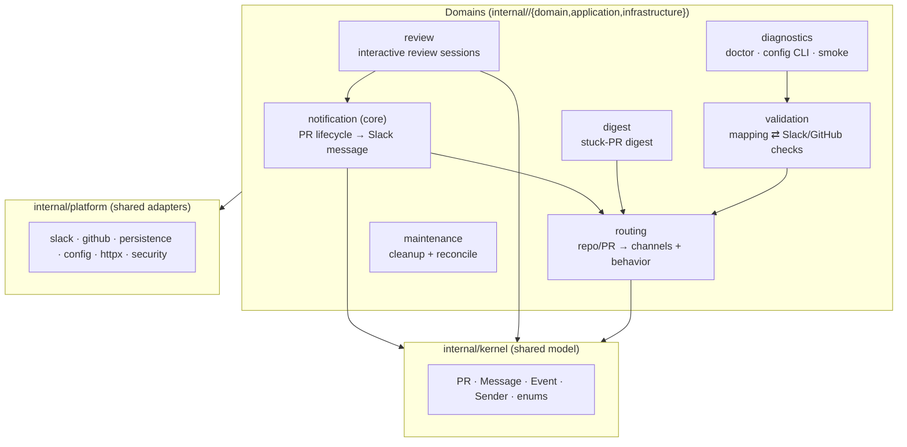

# Architecture

> **Status: migration complete.** This document is the source of truth for how notifycat is structured. The eight-phase DDD + hexagonal + uber/fx refactor is done; the architecture described here is the current codebase.

Notifycat follows **Domain-Driven Design** with a **hexagonal (ports-and-adapters)** layering and **compile-time-checked dependency injection via [uber/fx](https://github.com/uber-go/fx)**. The goal is a codebase where business logic is expressed in terms of interfaces it owns, technical details plug in at the edges, and the wiring is explicit and testable.

## Principles (always follow)

1. **Every domain is a folder** under `internal/`, and every domain is split into **three layers**: `domain/`, `application/`, `infrastructure/`.
2. **The domain layer owns the contracts.** Interfaces (`interfaces.go`), data-transfer objects (`models.go`), constants (`constants.go`), and enums (`enums.go`) live here. The domain layer imports nothing from `application/` or `infrastructure/` — it is the innermost ring and depends on no other layer.
3. **The application layer holds use cases.** Each use case is a concrete implementation of an interface, and **every use case must have an interface** declared in that domain's `domain/interfaces.go`. Use cases depend only on domain interfaces — never on a concrete implementation from another layer or domain.
4. **The infrastructure layer holds adapters, clients, and repositories.** Every infrastructure service **implements a domain interface** and **has its own interface** (its port, declared in the domain layer). Infrastructure is the only layer allowed to touch third-party SDKs, the database, HTTP, and the network.
5. **Depend on abstractions, not implementations.** A service references other services only through domain-layer interfaces. Concrete types are bound to those interfaces exactly once, in the fx wiring.
6. **No hardcoded values inside services.** Anything that reads like a constant or an enum must be one — declared in `constants.go` / `enums.go` in the relevant domain, never inlined as a magic string or number in a use case or adapter.
7. **More than three arguments → a DTO.** Any exported function or constructor that would take more than three arguments takes a single request/params struct instead, and that struct is a DTO in the domain layer.
8. **Doc comments live on interfaces.** The *why* and the contract are documented on the interface in the domain layer. Implementations stay terse — no doc block that merely restates the method name.
9. **One constructor per type, all dependencies injected.** No production-wiring façade paired with a test-seam constructor. If a test needs different dependencies, it passes them through the same constructor. (This predates the refactor and still holds.)
10. **TDD for new behavior.** RED → verify failure → GREEN → REFACTOR. Bug fixes start with a regression test.

## The three layers

Dependencies point **inward only**: `infrastructure` → `application` → `domain`. The domain layer is pure and knows nothing about Slack, GitHub, GORM, HTTP, or fx.

| Layer | Package | Contains | May import |
| --- | --- | --- | --- |
| **Domain** | `internal/<domain>/domain` | `interfaces.go` (ports + use-case interfaces), `models.go` (DTOs), `enums.go`, `constants.go`. Pure Go, no I/O. | The shared kernel only. |
| **Application** | `internal/<domain>/application` | Use cases — concrete implementations of the domain's use-case interfaces. Pure orchestration of domain ports. | Its own `domain`, the shared kernel. |
| **Infrastructure** | `internal/<domain>/infrastructure` | Adapters/clients/repositories implementing the domain's ports (Slack messenger, GORM repository, GitHub webhook receiver, …). | Its own `domain`, the shared kernel, the shared `platform`. |

### The dependency rule, concretely

- `application` and `infrastructure` may import their **own** `domain` and the **shared kernel**. Nothing else.
- **No domain imports another domain's `application` or `infrastructure`.** Cross-domain collaboration happens only through the shared kernel or through a port that the collaborating domain also depends on.
- `infrastructure` adapters are the one place concrete third-party clients are allowed. Wrapping `platform/slack.Client` inside `notification/infrastructure` to satisfy `notification/domain.Messenger` is the adapter's job — that is not a "depend on a concrete implementation" violation, because everything *upstream* of the adapter still sees only the port.

## Shared code: kernel and platform

A hexagonal Go app needs two pieces of connective tissue that are deliberately **not** per-domain. Both are kept minimal.

- **`internal/kernel`** — the **shared kernel**: the handful of value objects and enums shared across the notification, review, and routing domains (`PR`, `Message`, `Event`, `Sender`, `ReviewState`, GitHub event/action enums). Pure, dependency-free. This is a conscious DDD "shared kernel" so contexts don't re-translate the same PR identity at every boundary. *(If stricter context isolation is ever needed, this becomes per-domain models plus anti-corruption translation at boundaries.)*
- **`internal/platform/*`** — the **shared platform**: low-level, domain-agnostic clients and primitives that domain infrastructure adapters wrap.
  - `platform/slack` — raw Slack API client + Block Kit composer primitives.
  - `platform/github` — raw GitHub REST client.
  - `platform/persistence` — the GORM `*gorm.DB` handle, connection open/close, embedded goose migrations.
  - `platform/config` — env + `config.yaml` loading, plus the `Secret` type that hides credentials.
  - `platform/httpx` — shared inbound plumbing: cap the body, read it once, replay a fresh reader downstream. Provider-agnostic; delegates authentication to `platform/security`.
  - `platform/security` — inbound webhook **authentication**: a `SignatureVerifier` port with one adapter per provider scheme (GitHub raw-body HMAC-SHA256; Slack timestamped-base-string HMAC). The single home for "is this request genuinely from GitHub/Slack."

### Authentication and authorization

Notifycat has **no user accounts, sessions, logins, roles, or permissions**, so there is no authentication or authorization *domain* — modelling them as domains would produce empty, ruleless folders. The only authentication that exists today is **inbound webhook message authentication**: proving, by HMAC signature, that a request genuinely came from GitHub or Slack. That is a cross-cutting security concern, so it lives in **`platform/security`** as an explicit `SignatureVerifier` port with one adapter per provider scheme — not inside a business domain. The inbound adapters in `notification` and `review` consume that port and only parse the verified body; they never re-implement verification. Outbound credentials (the Slack bot token, the GitHub token) are `Secret`s from `platform/config`, passed to the `platform/slack` / `platform/github` clients.

**Authorization does not exist today** — single tenant, no access control beyond "is this webhook authentic." If the multi-tenant SaaS direction lands (see the productization plan), *then* authentication (tenant/user identity, GitHub-App OAuth installs, API keys) and authorization (tenant isolation, who may configure which mappings) become genuine bounded contexts — new `internal/identity` and `internal/access` domains alongside these seven, owning their ports in the domain layer and plugging into the same fx composition. That is deliberately out of scope for this refactor.

## Domain map

Seven domains over the shared kernel and platform. The core domain is **notification**; everything else supports it.



| Domain | Business capability | Absorbs today's packages |
| --- | --- | --- |
| **notification** | Receive a GitHub PR event and keep one Slack message per (PR, channel) in sync — post on open, update/react on state change, delete on draft. Includes bot-PR classification/formatting and AI-reviewer suppression. | `pullrequest` (dispatcher, open/close/draft + reaction handlers), `botpr`, `aireview`, `githubhook` parsing (verification → `platform/security`), the messages repository from `store` |
| **review** | The interactive "Start review" flow: a Slack button click records a reviewer and appends an in-review marker; a submitted GitHub review finishes sessions and clears the in-review state; reviewers are shown on close. | `startreview`, `slackhook` parsing (verification → `platform/security`), the `code_reviews` repository from `store`, the review-session logic in `pullrequest` |
| **routing** | Resolve a repo (and optionally a PR's changed files) to the Slack channel(s) and behavioral config that apply, across global/org/repo tiers and monorepo path rules. | `mappings` (provider, parsing, tiers, defaults, lock), the per-PR `Router` from `pullrequest`, the changed-files reader over `platform/github` |
| **validation** | Validate mapping entries against Slack (channel exists, bot present) and GitHub (repo exists); cache results in `config.lock`. Powers the startup gate, the doctor, and `notifycat-config validate`. | `validate` |
| **digest** | Periodically post a digest of stuck (stale) PRs per the enabled cron schedules. | `digest` |
| **maintenance** | Background housekeeping: delete stale message rows past their TTL; reconcile closed PRs. | `cleanup`, `reconcile` |
| **diagnostics** | Operator tooling: the preflight doctor, the `notifycat-config` CLI (list/validate), and the smoke-test delivery. | `doctor`, `mappingcli`, `smoke` |

`internal/app` (the old hand-written composition root) has been deleted: its wiring is per-domain fx modules, and its lifecycle orchestration is `fx.Lifecycle` hooks composed in `internal/runtime` and each `cmd/*/main.go`.

## Dependency injection with fx

The wiring is **uber/fx**. Each domain exports one `fx.Module` that provides its use cases and binds its infrastructure adapters to the domain's ports. Each binary is an `fx.New(...)` composing the modules it needs. Runtime lifecycle — the HTTP server, the cleanup scheduler, the digest scheduler, the DB handle — is managed by `fx.Lifecycle` `OnStart`/`OnStop` hooks, replacing the manual goroutine + `Cleanup func()` + signal juggling in `cmd/notifycat-server`.

A domain module binds concrete adapters to ports in exactly one place:

```go
// internal/notification/module.go
package notification

var Module = fx.Module("notification",
    // use cases (application) — provided as their domain interfaces
    fx.Provide(
        fx.Annotate(application.NewOpenPR, fx.As(new(domain.OpenPRUseCase))),
        fx.Annotate(application.NewClosePR, fx.As(new(domain.ClosePRUseCase))),
    ),
    // adapters (infrastructure) — bound to the domain ports they satisfy
    fx.Provide(
        fx.Annotate(infrastructure.NewSlackMessenger, fx.As(new(domain.Messenger))),
        fx.Annotate(infrastructure.NewMessageRepository, fx.As(new(domain.MessageStore))),
    ),
)
```

```go
// cmd/notifycat-server/main.go — lifecycle owned by fx
fx.New(
    platform.Module, kernel.Module,
    routing.Module, notification.Module, review.Module,
    digest.Module, maintenance.Module,
    fx.Invoke(func(lc fx.Lifecycle, srv *http.Server, sched *maintenance.CleanupScheduler) {
        lc.Append(fx.Hook{OnStart: srv.serve, OnStop: srv.Shutdown})
        lc.Append(fx.Hook{OnStart: sched.Start, OnStop: sched.Stop})
    }),
).Run()
```

Binary → module composition:

| Binary | Modules |
| --- | --- |
| `notifycat-server` | platform, kernel, routing, validation, notification, review, digest, maintenance + HTTP server |
| `notifycat-config` | platform, kernel, routing, validation, diagnostics |
| `notifycat-doctor` | platform, kernel, routing, validation, diagnostics |
| `notifycat-migrate` | platform (persistence only) |
| `notifycat-reconcile` | platform, kernel, maintenance |
| `notifycat-smoke` | platform, kernel, diagnostics |

## Cross-cutting conventions

- **DTOs for wide signatures.** A constructor or exported method that needs more than three inputs takes one params struct from the domain layer (e.g. `domain.PostMessageRequest`) rather than a positional argument list.
- **Enums and constants, never literals.** Reaction names, event names, actions, no-op reasons, tier names, check statuses — all enums/constants in the owning domain. A service must not compare against `"submitted"` or `"pull_request_review"` inline.
- **Doc blocks on interfaces.** Document the contract and rationale on the port; leave implementations uncommented unless a non-obvious *why* (a workaround, a hidden invariant) needs recording.
- **Readable names over terse Go idiom.** `repoMapping`, `digestConfig` — not `m`, `d`. (Unchanged from the pre-refactor convention.)
- **Consumer-package interfaces are retired.** The previous convention declared interfaces where they were *used*; under DDD, ports live in the domain layer that *owns* them. This is the one deliberate reversal from the old codebase.

## What carries over vs. what changes

**Carries over:** one-constructor-per-type with all deps injected; readable names; no comments that restate code; TDD discipline; the commit/PR/release rules; never committing operator state (`config.yaml`, `config.lock`, `.env`, `/data/`).

**Changed:** interfaces moved from consumer packages into domain layers; packages reorganized from technical-concern to domain-with-layers; the hand-written `app.Wire` composition root was replaced by fx modules + lifecycle in `internal/runtime`; every use case and every infrastructure service has an explicit domain-layer interface.
