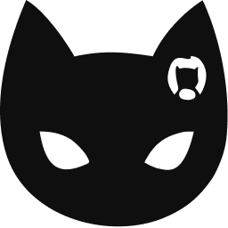

# Notifycat

<p align="center">
  
</p>

[](https://github.com/mptooling/notifycat/actions/workflows/ci.yml)
[](https://github.com/mptooling/notifycat/releases/latest)
[](go.mod) [](https://goreportcard.com/report/github.com/mptooling/notifycat)
[](LICENSE) [](https://www.conventionalcommits.org)

Notifycat listens for GitHub pull request webhooks and keeps Slack up to date.

One pull request gets one Slack message. As the PR opens, moves to draft, gets reviewed, merges, or closes, Notifycat
updates that message and adds the configured reactions. The result is a quieter channel: reviewers can follow the state
of a PR without digging through repeated notifications.

It is intentionally small: one HTTP endpoint, a SQLite database (for Slack message timestamps), and a declarative `config.yaml` that holds all settings and decides which PRs route to which Slack channels.

## Quick start

**You'll need** a host with Docker + Compose V2, a domain name pointing at it, and inbound ports 80/443 open.
**In about 10 minutes** you'll have Notifycat running behind automatic HTTPS and posting PR updates to Slack — no Go
toolchain, no SQLite client, no manual file editing.

```sh
curl -fsSL https://github.com/mptooling/notifycat/releases/latest/download/install.sh | sh
cd notifycat
./notifycat setup          # interactive wizard — writes .env and config.yaml
docker compose up -d       # start Notifycat + Caddy (HTTPS via Let's Encrypt)
./notifycat doctor         # verify setup
```

The installer downloads a pinned, checksum-verified bundle into `./notifycat`. The setup wizard prompts for your domain,
Slack token, webhook secret, and first mapping. For the full walkthrough — webhook registration, a delivery smoke test,
and troubleshooting — see [Install with Docker Compose](https://mptooling.github.io/notifycat/compose/), then run through
the [Security & permissions](https://mptooling.github.io/notifycat/security/) checklist before go-live.

### Alternative: run from source (contributors)

Most users want the one-command path above. Build from source if you're contributing or want to run without Docker.

**Requires:**

- Go 1.25.10 or newer (`go version` to check).
- `git` to clone the repository.
- `sh` and `curl` for the helper scripts under `scripts/`.
- A public URL (ngrok or Cloudflare Tunnel) only if you want GitHub to deliver real webhooks to your laptop. Local CLI
  commands (validate / doctor) don't need one.

Six commands from "nothing" to "running":

```sh
git clone https://github.com/mptooling/notifycat.git && cd notifycat
cp .env.example .env                       # then edit: set GITHUB_WEBHOOK_SECRET, SLACK_BOT_TOKEN
cp config.example.yaml config.yaml        # then edit: database.url and real Slack channel IDs

go run ./cmd/notifycat-config validate
go run ./cmd/notifycat-doctor
go run ./cmd/notifycat-server
```

The binaries pick up `.env` from the current working directory and default to `./mappings.yaml` and
`./data/notifycat.db`. See [Getting started](https://mptooling.github.io/notifycat/getting-started/) for the end-to-end
walkthrough including the tunnel + webhook setup.

## What It Handles

- `pull_request` webhooks for opened, closed, and converted-to-draft PRs.
- `pull_request_review` webhooks for approved, commented, and changes-requested reviews.
- `pull_request_review_comment` webhooks for line-specific PR comments.
- GitHub HMAC-SHA256 verification through `X-Hub-Signature-256`.
- Repository routing from the `mappings:` section of `config.yaml` — explicit lists or `repositories: "*"` for a whole org. See [`config.example.yaml`](config.example.yaml).
- Slack message updates instead of repeated new messages for the same PR.

## Binaries

| Binary | Purpose |
| --- | --- |
| `notifycat-server` | HTTP server for GitHub webhooks |
| `notifycat-config` | CLI for listing and validating config.yaml (mappings and settings) |
| `notifycat-migrate` | Applies embedded SQLite migrations |
| `notifycat-doctor` | Preflight diagnostics (config, database, mappings, optional per-repo Slack/GitHub) |
| `notifycat-smoke` | Forges a signed PR event end-to-end to confirm Slack delivery |

## Documentation

Full documentation is published at <https://mptooling.github.io/notifycat/>.

- [Install with Docker Compose](https://mptooling.github.io/notifycat/compose/) — the recommended one-command path
- [Security & permissions](https://mptooling.github.io/notifycat/security/) — least-privilege model and pre-go-live checklist
- [Getting started](https://mptooling.github.io/notifycat/getting-started/)
- [Mappings file](https://mptooling.github.io/notifycat/mappings/)
- [Configuration](https://mptooling.github.io/notifycat/configuration/)
- [Slack app setup](https://mptooling.github.io/notifycat/slack-app/)
- [GitHub webhook setup](https://mptooling.github.io/notifycat/github-webhook/)
- [Docker (manual)](https://mptooling.github.io/notifycat/docker/)
- [Operations](https://mptooling.github.io/notifycat/operations/)
- [Doctor](https://mptooling.github.io/notifycat/doctor/)

## Development

The project includes a `justfile` for common development commands. Install [`just`](https://github.com/casey/just)
(`brew install just` on macOS), then run:

```sh
just
just check
just serve
```

`just` is a developer tool only. It is not part of the Go module, the Docker runtime image, or production dependencies.

The underlying checks are:

```sh
go vet ./...
golangci-lint run ./...
govulncheck ./...
go test -race ./...
go build ./...
```

See [CONTRIBUTING.md](CONTRIBUTING.md) for contributor setup, pull request expectations, and issue reporting guidance.

## Community

- [Code of conduct](CODE_OF_CONDUCT.md)
- [Support](SUPPORT.md)
- [Security policy](SECURITY.md)

## License

MIT. See [`LICENSE`](LICENSE).
