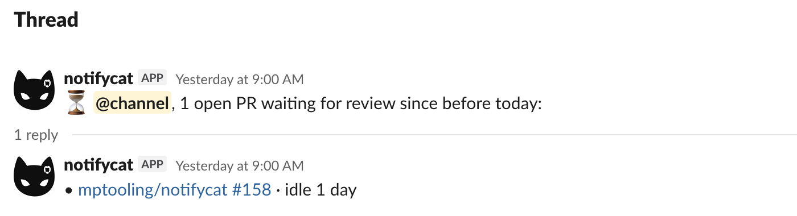

# Stuck-PR digest

Once a day, Notifycat reminds each channel about the open PRs nobody has touched since the previous day. It's the safety net under the quiet: a PR that got buried yesterday resurfaces this morning, every morning, until someone deals with it.

--8<-- "docs/assets/images/diagrams/digest-timeline.svg"

## What it posts

Two items per channel with stuck PRs: a parent message carrying the count and pinging the channel's configured `mentions`, and a single threaded reply listing the PRs. The list lives in the thread, so the channel feed pays one line per day — and channels with nothing stuck get nothing at all.



Mentions sit on the parent because Slack thread replies don't notify the channel.

## It's on by default

With no `digest:` section in `config.yaml`, the digest runs at **9am UTC daily**. This is deliberate — the digest is the "nothing slips through" half of the product. To opt out:

```yaml
digest:
  enabled: false
```

## Schedule and timezone

```yaml
digest:
  enabled: true
  schedule: "0 9 * * *"      # standard 5-field cron
  timezone: "Europe/Kyiv"    # IANA zone; default UTC
```

Both the firing time and the "stuck since before today" cutoff are evaluated in `timezone`. An invalid cron expression or an unrecognized zone fails server startup — same fail-fast contract as the rest of the config. Setting the container's `TZ` variable does nothing; use this key.

## What counts as stuck

A PR is stuck when its last activity predates the start of the current day (in the configured zone). Activity is anything Notifycat sees on the PR: the open announcement, a review — approve, comment, request changes — or a PR/line comment. Two deliberate exclusions:

- **Suppressed bot reviews don't count.** With `reviews.ignore_ai_reviews: true`, an AI-only review pass leaves the PR stuck — it still needs a human.
- **Merged, closed, and drafted PRs drop out.** Merge/close marks the row; converting to draft removes it entirely.

A monorepo PR that [fanned out](monorepo.md) to several channels appears in each of those channels' digests until it's done.

## Per-repository overrides

A repository tier (or org `"*"` tier) can set its own `digest.enabled` and `digest.schedule` — `timezone` is global only, since the server runs a single clock. Note that two repositories posting to the same channel on different schedules produce two digests a day in that channel; each tier's schedule runs independently.

## First run after an upgrade

<a id="reconcile"></a>

If you enabled the digest on a deployment that predates it, the first run can list PRs that merged long ago — old rows have no open/closed marker, so the digest assumes open. Fix it once with the reconciler, which asks the git host for each PR's real state and marks the closed ones:

```sh
docker compose run --rm notifycat /usr/local/bin/notifycat-reconcile -dry-run   # preview
docker compose run --rm notifycat /usr/local/bin/notifycat-reconcile           # apply
```

It's idempotent, needs a read token (`GITHUB_TOKEN` / `BITBUCKET_TOKEN`) plus the same database the server uses, and leaves any PR it can't read untouched rather than wrongly hiding it. It prints a summary like `reconcile (applied): checked=37 closed=34 still_open=3 errors=0`; a non-zero error count exits non-zero — usually a token-scope issue, fix and re-run. After this one run the close handler keeps rows marked by itself. See also [Upgrading → 0.16.0](upgrading.md#0160-stuck-pr-digest).
