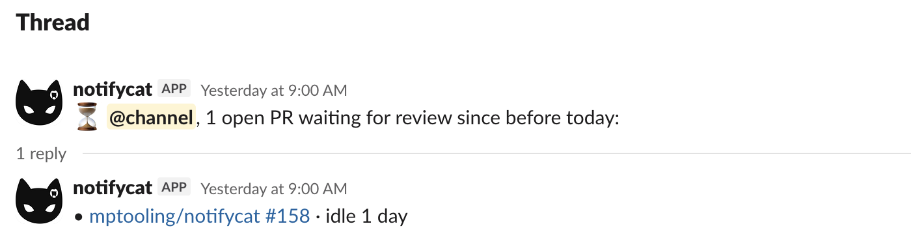

# Stuck-PR digest

Once a day, Notifycat reminds each channel about the open PRs nobody has touched since the previous day. It's the safety net under the quiet: a PR that got buried yesterday resurfaces this morning, every morning, until someone deals with it.

<div class="nc-diagram-wrap">
--8<-- "docs/assets/images/diagrams/digest-timeline.svg"
</div>

## What it posts

Two items per channel with stuck PRs: a parent message carrying the count and pinging the channel's configured `mentions`, and a single threaded reply listing the PRs. The list lives in the thread, so the channel feed pays one line per day — and channels with nothing stuck get nothing at all.



Mentions sit on the parent because Slack thread replies don't notify the channel.

## It's on by default

With no `digest:` section in `config.yaml`, the digest runs at **9am UTC on weekdays**. This is deliberate — the digest is the "nothing slips through" half of the product. To opt out:

```yaml
digest:
  enabled: false
```

## Schedule and timezone

```yaml
digest:
  enabled: true
  schedule: "0 9 * * *"      # standard 5-field cron
  timezone: "Europe/Kyiv"    # IANA zone; default UTC
```

Both the firing time and the "stuck since before today" cutoff are evaluated in `timezone`. An invalid cron expression or an unrecognized zone fails server startup — same fail-fast contract as the rest of the config. Setting the container's `TZ` variable does nothing; use this key.

## Weekends and holidays

**Weekends are always skipped.** Saturday and Sunday never get a digest, whatever the schedule says — there is no key to turn this off. A digest nobody reads is worse than no digest: the same PRs are still stuck on Monday and get announced then. If your cron spec deliberately targets a weekend (`0 9 * * 6`), it will never fire.

Public holidays need a country, because holidays vary by country and there is no sane default:

```yaml
digest:
  timezone: "Europe/Berlin"
  country: DE               # ISO 3166-1 alpha-2; case-insensitive
```

Both checks are evaluated in `digest.timezone`, so "Saturday" means Saturday where the team is, not in UTC.

**With no `country` set, holidays are not skipped** — only weekends. The server says so once at boot:

```
WARN digest holidays not configured detail="digest.country is unset; weekends are skipped but public holidays are not"
```

### Supported countries

| Code | Country | Code | Country | Code | Country |
| --- | --- | --- | --- | --- | --- |
| `AT` | Austria | `FR` | France | `NO` | Norway |
| `BE` | Belgium | `GB` | United Kingdom | `PL` | Poland |
| `CH` | Switzerland | `IE` | Ireland | `PT` | Portugal |
| `DE` | Germany | `IT` | Italy | `SE` | Sweden |
| `DK` | Denmark | `LU` | Luxembourg | `UA` | Ukraine |
| `ES` | Spain | `NL` | Netherlands | `US` | United States |
| `FI` | Finland | | | | |

An unrecognized code does **not** fail startup. The server warns once, lists the supported set, and runs weekends-only — the same state as no country at all:

```
WARN digest country not recognized country=Germany detail="digest.country is not a supported country code; weekends are skipped but public holidays are not" supported="AT, BE, CH, ..."
```

That is deliberate: `digest.schedule` and `digest.timezone` decide whether the server runs at all and so fail fast, but the country only enriches one feature. A typo in it must not take the deployment down.

Each table carries that country's **national** public holidays. Two deliberate additions and several known limits:

- **December 24 and 31 are treated as holidays in every country.** In most of them they are not legal public holidays, but they are near-universal shutdown days for engineering teams. (In Poland, Wigilia became statutory in 2025, so there it is a real holiday.)
- **Regional holidays are not covered.** `DE` is the nine federal days — a Bavarian team still gets a digest on Fronleichnam. Likewise `GB` is England and Wales, `ES` and `FR` are the national sets, and `CH` is approximate by nature, since only August 1 is federal there and the rest is cantonal.
- **`IE`** models St Brigid's Day as the first Monday in February; the statutory rule shifts it to February 1 when that day is a Friday, so 2030 and 2036 are wrong.
- **`UA`** carries fixed-date holidays only. Orthodox Pascha needs Julian-calendar arithmetic and both Pascha and Trinity Sunday fall on a Sunday anyway; martial law currently suspends Ukrainian public holidays entirely, which no calendar can model.

Where a holiday falls on a weekend, the country's real rule applies: `US` shifts to the nearest weekday (Saturday back to Friday, Sunday forward to Monday), `GB` and `IE` add a substitute day — so Christmas 2027, a Saturday, is observed on Monday the 27th and Boxing Day on Tuesday the 28th — and continental Europe simply loses the day.

### Skipped runs in the log

A skipped day makes **no Slack call at all** and logs one line:

```
INFO skipped digest schedule="0 9 * * *" reason=weekend date=2026-07-04 weekday=Saturday
INFO skipped digest schedule="0 9 * * *" reason=holiday date=2026-12-25 country=DE holiday="1. Weihnachtstag"
```

`reason` is `weekend` or `holiday`, the same shape as the [`ignored webhook event`](troubleshooting.md#200-ok-no-slack-change) reason contract.

## What counts as stuck

A PR is stuck when its last activity predates the start of the current day (in the configured zone). Activity is anything Notifycat sees on the PR: the open announcement, a review — approve, comment, request changes — or a PR/line comment. Two deliberate exclusions:

- **Suppressed bot reviews don't count.** With `reviews.ignore_ai_reviews: true`, an AI-only review pass leaves the PR stuck — it still needs a human.
- **Merged, closed, and drafted PRs drop out.** Merge/close marks the row; converting to draft removes it entirely.

## Which channels get it

The reminder follows `config.yaml`, not the channel a PR's message was posted to. Each repository's digest goes to its configured base channels — the tier's `channel:`, or every entry of its `channels:` list, each pinging that entry's own `mentions`.

Per-directory [`paths:`](monorepo.md) channels get no digest. Which path rule applied to a given PR isn't knowable without re-reading the PR's changed files, so a monorepo's stuck PRs are nagged in the repo's base channel even when the original announcement fanned out to a path channel.

Repointing a repository at a new channel therefore moves its digest immediately. The messages of PRs that were already open keep living in the old channel until you move them with [`notifycat-relocate`](cli.md#notifycat-relocate).

## Per-repository overrides

A repository tier (or org `"*"` tier) can set its own `digest.enabled` and `digest.schedule` — `timezone` and `country` are global only, since the server runs a single clock and serves a single team calendar. Note that two repositories posting to the same channel on different schedules produce two digests a day in that channel; each tier's schedule runs independently.

## First run after an upgrade

<a id="reconcile"></a>

If you enabled the digest on a deployment that predates it, the first run can list PRs that merged long ago — old rows have no open/closed marker, so the digest assumes open. Fix it once with the reconciler, which asks the git host for each PR's real state and marks the closed ones:

```sh
docker compose run --rm notifycat /usr/local/bin/notifycat-reconcile -dry-run   # preview
docker compose run --rm notifycat /usr/local/bin/notifycat-reconcile           # apply
```

It's idempotent, needs a read token (`GITHUB_TOKEN` / `BITBUCKET_TOKEN`) plus the same database the server uses, and leaves any PR it can't read untouched rather than wrongly hiding it. It prints a summary like `reconcile (applied): checked=37 closed=34 still_open=3 errors=0`; a non-zero error count exits non-zero — usually a token-scope issue, fix and re-run. After this one run the close handler keeps rows marked by itself. See also [Upgrading → 0.16.0](upgrading.md#0160-stuck-pr-digest).
