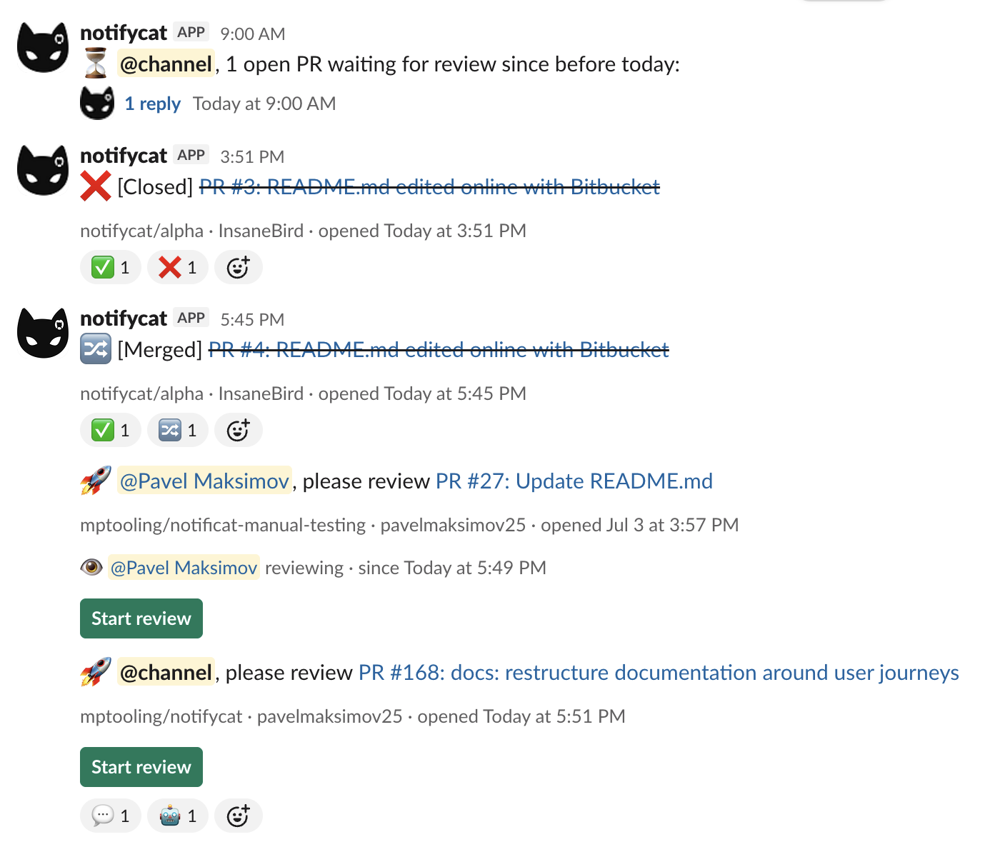
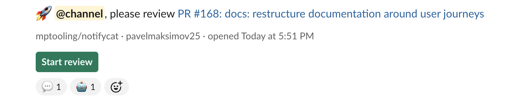
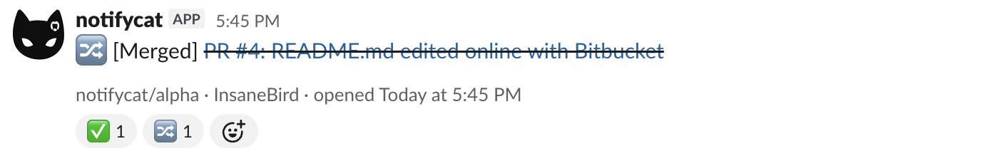
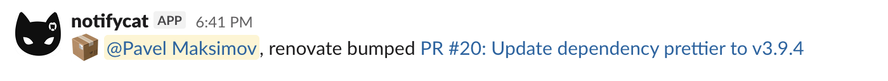

# What you see in Slack

This page is a tour of Notifycat from inside Slack — every message shape and reaction the bot produces, and where to change each one.

## The PR message

A new pull request (non-draft, or freshly marked ready for review) posts one message to the mapped channel:

- **Headline** — `:eyes: <mentions>, please review <PR #N: title>`, linked to the PR. Mentions come from your [mapping](routing.md#mentions); with none configured the message falls back to `@channel`, and with `mentions: []` it posts silently.
- **Context line** — `owner/repo · author · opened <time>`, rendered in each viewer's own timezone.

That's the last new message this PR will produce. Everything below happens *on* it.

## Lifecycle reactions

Review activity lands as emoji reactions, so the channel feed never moves:

| Event | Default reaction |
| --- | --- |
| PR opened | :eyes: `eyes` (also the message's leading emoji) |
| Review approved | :white_check_mark: `white_check_mark` |
| Review commented | :speech_balloon: `speech_balloon` |
| Changes requested | :exclamation: `exclamation` |
| PR merged | :twisted_rightwards_arrows: `twisted_rightwards_arrows` |
| PR closed without merge | :x: `x` |
| Bot reviewer activity | :robot_face: `robot_face`, added alongside the normal reaction |

Every emoji is configurable globally and per repository — see [Reactions & bot reviews](bots-and-reactions.md).

## Merge and close

When the PR merges or closes, the message updates in place: the title is struck through, the leading emoji swaps to the merged/closed reaction, and a `[Merged]` or `[Closed]` label is prepended. The context line stays, and if anyone reviewed the PR, a muted `reviewed by @user, …` line lists them.

A PR converted back to draft is the one case where the message is *removed* — drafts aren't up for review, so they don't occupy the channel. Marking it ready again re-announces it.

## The review flow

Each PR message carries a **Start review** button. Clicking it appends an `:eye: @you reviewing` marker, visible to the whole channel — no more two people silently reviewing the same PR, and no more "is anyone on this?".

<video autoplay loop muted playsinline width="700">
  <source src="../assets/videos/review-flow.mp4" type="video/mp4">
</video>

When a review is actually submitted on the git host, all active markers clear and a muted `reviewed by @user, …` line replaces them. The button stays as long as the PR is open, so a second round of review can start the same way. Only a real review submission ends a session — line comments and conversation comments don't.

## Bot reviews: marked or muted

Bot reviewers (Copilot, dependabot, CI auto-approvals — anything the git host reports as a bot) get the normal state reaction **plus** the :robot_face: marker, so a green checkmark from a human and one from a bot never look the same. Prefer silence instead? One config key suppresses bot reactions entirely. Details and trade-offs in [Reactions & bot reviews](bots-and-reactions.md#bot-reviewers).

## Dependabot and Renovate, compacted

Dependency PRs don't deserve a "please review" ceremony. PRs opened by `dependabot[bot]` or `renovate[bot]` post a single compact line instead:

- `:package: <bot> bumped <PR link>` for routine bumps
- `:rotating_light: <bot> security update <PR link>` when the PR body carries a security advisory

Set `reviews.dependabot_format: false` to give bot PRs the standard format instead.

## The morning digest

Once a day (9am UTC by default), each channel with stuck PRs gets a two-part reminder: a parent message with the count that pings the channel's configured mentions, and a single threaded reply listing the PRs. The list lives in the thread, so the channel feed pays exactly one line per day.

A PR counts as stuck when nothing happened on it since the previous day — no review, no comment, nothing. Suppressed bot reviews deliberately don't count as activity, so an AI-only pass never hides a PR that still needs a human. Schedule, timezone, per-repository overrides, and how to turn it off: [Stuck-PR digest](digest.md).

## Adaptive loudness (optional AI)

Everything above is deterministic. Notifycat can optionally route each of these presentation choices — how loud a message pings, which mentions it carries, the leading emoji, standard vs. compact format, and the order of the digest — through an AI salience layer that tunes them per channel from the PR's own signals. It never decides *whether* a message is sent, and with the layer off (the default) or on any failure the result is byte-identical to what this page describes. See [AI notifications](ai.md).
