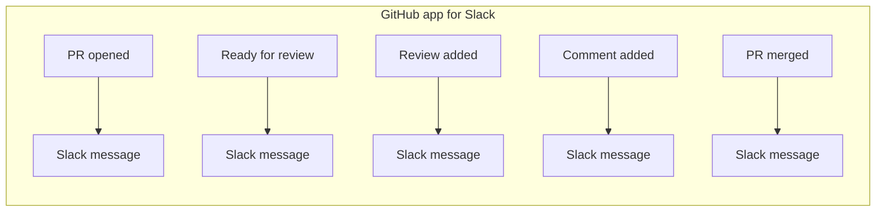
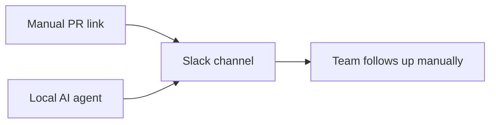
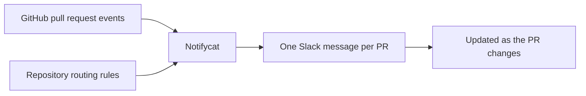

# Notifycat Docs

These docs are written for engineers deploying or integrating Notifycat.

## Get started in ~10 minutes

The recommended path is the one-command Docker Compose install — it brings up Notifycat behind automatic HTTPS:

```sh
curl -fsSL https://github.com/mptooling/notifycat/releases/latest/download/install.sh | sh
cd notifycat
./notifycat setup          # interactive wizard — writes .env and config.yaml
docker compose up -d       # start Notifycat + Caddy (HTTPS via Let's Encrypt)
./notifycat doctor         # verify setup
```

See [Install with Docker Compose](compose.md) for the full walkthrough, then run the
[Security & permissions](security.md) checklist before go-live.

## The Usual Slack Setup

The regular way to connect GitHub pull requests to Slack is the official GitHub app for Slack. A channel subscribes to a
repository with `/github subscribe owner/repo`, then enables pull request-related activity such as `pulls`, `reviews`,
and `comments`.

That works, but each type of activity can become another Slack item. A pull request opens, gets reviewed, receives
comments, moves out of draft, and eventually closes or merges. The channel gets the events, but the current state can be
hard to see at a glance.



## Other Common Options

Many teams keep it manual: the author posts the pull request link in the right Slack channel and asks for reviews. It is
simple, but it depends on people remembering to post updates when the pull request changes.

Another option is a local AI agent that watches pull requests and posts a summary or reminder into Slack. That can be
useful, but it adds runtime, model, and maintenance cost for a workflow that often only needs reliable state updates.



## The Notifycat Model

Notifycat keeps the Slack side quiet. GitHub sends pull request events, Notifycat routes each repository to the right
channel, and one pull request keeps one Slack message. As the pull request changes, the message changes with it.



## Documentation

- [Install with Docker Compose](compose.md): one-command installer, setup wizard, HTTPS via Let's Encrypt.
- [Security & permissions](security.md): least-privilege model, the webhook-secret trust boundary, and a pre-go-live
  checklist.
- [Getting started](getting-started.md): local setup and first end-to-end run.
- [Mappings file](mappings.md): the declarative `mappings:` section of `config.yaml` — schema, lookup rules, lock file, and CLI workflow.
- [Configuration](configuration.md): environment variables, database, and reactions.
- [Slack app setup](slack-app.md): manifest-based app creation, bot scopes, token setup, channel IDs, and mentions.
- [GitHub webhook setup](github-webhook.md): script-based webhook creation, required GitHub access, PR events, comment
  events, secret handling, and delivery checks.
- [Docker (manual)](docker.md): image layout, migrations, persistence, and runtime commands.
- [Operations](operations.md): deployment model, persistence, logs, release images, and CI checks.
- [Upgrading](upgrading.md): release-specific upgrade steps, including the 0.16.0 stuck-PR digest.
