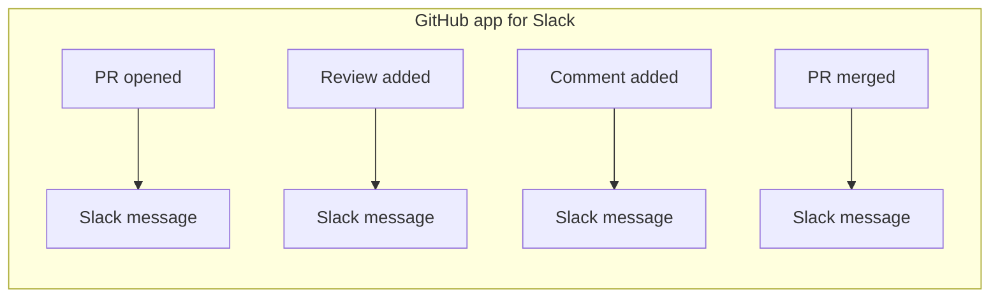
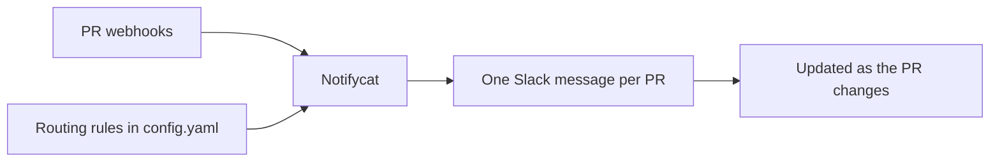

# Notifycat

**Low-noise pull request notifications for Slack.** One pull request gets one Slack message. As the PR moves — reviewed, approved, merged, closed — that message updates in place instead of posting again.

<!-- TODO(media): hero screenshot — a Slack channel showing 3–4 Notifycat PR messages in different states: one fresh (mentions + title + context line), one with an :eye: reviewer marker, one merged (struck-through title, [Merged] label). This is the single most important visual in the docs. Light theme, ~900px wide. Suggested file: assets/hero-channel.png -->

Your channel becomes a status board, not an event log. Anyone can see where every PR stands at a glance, without scrolling through five notifications to work out whether something still needs eyes.

## Why teams run it

**Quiet.** State changes become message updates and emoji reactions, not new posts. Dependabot bumps collapse to a single compact line. Bot reviews can be marked or muted entirely. A busy repository produces one Slack line per PR — total.

**Nothing slips through.** A morning digest resurfaces open PRs that nobody touched yesterday. The "Start review" button shows who is already reviewing, so two people don't pick up the same PR — and forgotten ones don't stay forgotten. See [What you see in Slack](features.md) for the full tour.

**Easy to own.** One Go binary, one declarative `config.yaml`, one SQLite file. The server validates its whole configuration against Slack and your git host *before it boots*, so a typo'd channel ID fails at deploy time, not at webhook time. Runtime needs exactly two secrets: a webhook secret and a Slack bot token — no GitHub App, no OAuth flow, no admin scopes.

## The problem it solves

The usual way to connect pull requests to Slack is the official GitHub app: `/github subscribe owner/repo` plus `pulls`, `reviews`, and `comments`. It works, but every event becomes another Slack item. A PR opens, collects two reviews and a few comments, leaves draft, and merges — and the channel gets each of those as a separate message. The events are all there; the *current state* is nowhere.

Notifycat inverts that. Your git host sends PR webhooks, Notifycat routes each repository to the right channel, and one PR keeps one message. Reviews and comments land on it as reactions; merge strikes it through.

## When it's not the fit

Notifycat is deliberately narrow. Pick something else if:

- **You want the full event stream in Slack.** Every review and comment as its own post is exactly what the official GitHub app does well.
- **You need GitHub and Bitbucket in one place.** A deployment serves one git host; covering both means two instances, each with its own configuration and database.
- **You need more than pull requests.** Issues, deployments, CI status — out of scope by design.
- **You post to more than one Slack workspace.** One deployment carries one bot token, so it posts to one workspace.

## Git Provider Support

| Feature | GitHub | Bitbucket |
| --- | --- | --- |
| Webhook signature verification (HMAC-SHA256) | Yes | Yes |
| Per-path / monorepo routing | Yes (needs `GITHUB_TOKEN`) | Yes (needs `BITBUCKET_TOKEN`) |
| Stuck-PR digest | Yes | Yes |
| Reactions & review flow | Yes | Yes |
| Token auth | Fine-grained PAT (Bearer) | Access token (Bearer) or scoped Atlassian API token (Basic) |

## Where next

| You want to… | Go to |
| --- | --- |
| See what it looks like in Slack | [What you see in Slack](features.md) |
| Get it running in ~10 minutes | [Install with Docker Compose](compose.md) |
| Understand the configuration model in two minutes | [Configuration basics](configure.md) |
| Point repositories at channels, tune mentions and reactions | [Route repositories to channels](routing.md) |
| Fix a delivery that didn't reach Slack | [Troubleshooting](troubleshooting.md) |
| Look up every config key | [config.yaml reference](configuration.md) |
